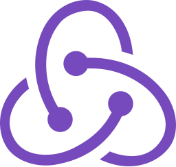

### Hi there, I'm Sean 👋

## I'm a 3rd year Computer Science student in NUS!

- 🌱 I’m currently studying SWE, Databases and Artificial Intelligence
- 🔭 I’m looking to collaborate with other developers

### Connect with me:

<!-- [.com" src="https://raw.githubusercontent.com/iconic/open-iconic/master/svg/globe.svg" />][website] -->

[][linkedin]
[][instagram]

<!-- [][medium] -->

 

## Languages & Technologies

  
  &nbsp;
    
  &nbsp;
  
&nbsp;  
  
&nbsp;
    
  &nbsp;
  
  &nbsp;

&nbsp;

&nbsp;

&nbsp;

&nbsp;

&nbsp;

&nbsp;

 
 

---

## Learn more about me at

- [Personal Website](https://www.seanlumjy.com/)
- [LinkedIn](https://www.linkedin.com/in/jyjy98/)

---

  
  
:zap: GitHub stats

  
  

<!-- [website]: <my website> -->

[instagram]: https://www.instagram.com/seanthemeh/
[linkedin]: https://www.linkedin.com/in/jyjy98/
